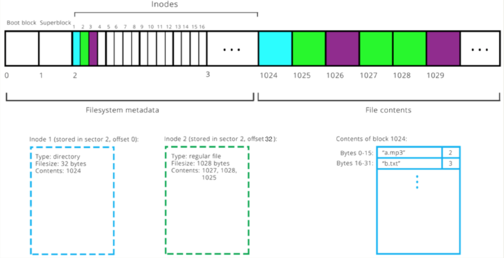
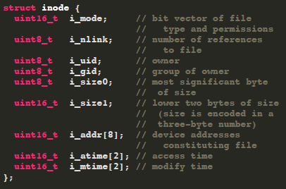

# Lecture 03: Layering, Naming, and Filesystem Design

Storage has its own divided layer called `sector` and filesystem has `block`. So multiple sectors can be bounded to one block.

## 1. Filesystem

The diagram below includes illustrations for a 32 byte (blue) and a 1028 (or 2 * 512 + 4) (green) byte
file

Fig.1 - filsystem

* The first block is the boot block, which typically contains information about the hard drive itself. It's
so named because its contents are generally tapped when booting

* The second block is the superblock, which contains information about the filesystem imposing itself
onto the hardware.

* The rest of the metadata region (at most
10%) stores the inode table, which at the highest level stores information
about each file stored somewhere within the filesystem.

* File payloads are stored in quantums of 512 bytes (or whatever the block size is).

## 2. Inode

`inodes` are data structures that store metainfo about a single file. Stored within an inode are items
like file owner, file permissions, creation times, and, most importantly for our purposes, file type, file
size, and the sequence of blocks enlisted to store payload. (So if you clear inode area, you cannot find your files)

32 bytes / inode -> 16 inodes / block

Each `directory` (one type of file) has its own inumber, and that inode directs contents, which contains path string and inumber (blue contents of [Fig.1 - filsystem]) - 14 bytes for filename string, 2 bytes for inumber. (so, in this os, we cannot make filename longer than 14 and actually ms dos was like this - 8 for name and 3 for extension)

What does the file lookup process look like, then? Consider a file at
'/usr/class/cs110/example.txt'. First, we find the inode for the file /(which always has
inumber 1. See [here](https://stackoverflow.com/questions/2099121/why-do-inode-numbers-start-from-1-and-not-0) about why it is 1 and not 0). We search inode 1's payload for the token 'usr' (linear search)
and its companion inumber. Let's say it's at inode 5. Then, we get inode 5's contents (which is
another directory) and search for the token class in the same way. From there, we look up the
token 'cs110' and then 'example.txt'. This will (finally) be an inode that designates a file, not a
directory.

## 3. Inode: Indirect addressing

Inodes can only store a maximum of 8 block numbers. This presumably
limits the total file size to 8 * 512 = 4096 bytes. That's way too small for any reasonably sized file.

To resolve this problem, we use a scheme called `indirect addressing`. Instead of block storing files, it stores inumbers(block numbers). In singly-indirect addressing, we could store up to 8 (actually 7) singly indirect block numbers in an inode, and each can store 512 /
2 = 256 block numbers. This increases the maximum file size to 8 * 256 * 512 = 1,048,576
bytes = 1 MB.

To make the max file size even bigger, Unix V6 uses the 8th block number of the inode
to store a doubly indirect block number. The total number of singly indirect block numbers we can have is 7 + 256 = 263, so the maximum file size
is 263 * 256 * 512 = 34,471,936 bytes = 34MB.

That's still not very large by today's standards, but remember we're referring to a file system design from
1975, when file system demands were lighter than they are today. In fact, because inumbers were only 16
bits, and block sizes were 512 bytes, the entire file system was limited to 32MB.

> Q.what's 'flag' to use indirect addressing?
>   > system looks at filesize (i_size0, i_size1) and if it's larger than 4096, flag is set.

## 4. Inode: Hard link and Soft link

Hard link (`ln <original-file> <new-file>`) increase original file's `i_nlink` in that inode. A file is removed from the
disk only when this reference count becomes 0, and when no
process is using the file (i.e., has it open). This means, for instance,
that rm filename can even remove a file when a program has it
open, and the program still has access to the file (because it
hasn't been removed from the disk). This is not true for many
other file systems (e.g., Windows)!

Soft link (`ln -s <original-file> <new-file>`) is a special file
that contains the path of another file, and has no reference to the inumber. Reference count for the original file
remains unchanged. If we delete the original file, the soft link
breaks! The soft link remains, but the path it
refers to is no longer valid. If we had
removed the soft link before the file, the
original file would still remain.

# Lecture 04: Files, Memory, and Processes

